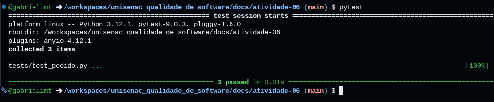

# Aula 9 – Testes Unitários e TDD

## 👥 Integrantes
- Gabrieli Morales Taborda

---

## 📁 Estrutura do Projeto

.  
├── src/  
│   └── pedido.py  
└── tests/  
    └── test_pedido.py  

---

## 🔹 1. Funcionalidade Escolhida

### 👤 Gabrieli Morales Taborda – Cálculo do total do pedido com valor mínimo

Cada integrante implementou seus testes unitários no respectivo arquivo dentro da pasta `/tests`.

#### Descrição
Soma os valores dos itens do pedido e valida se o total atinge o valor mínimo.

#### Regras de negócio
- Soma dos itens define o total  
- Pedido deve atingir valor mínimo  
- Caso contrário, deve gerar erro  

---

## 🔹 2. Testes Unitários

### 🧪 Testes (pedido)

#### Teste 1 – Total igual ao mínimo (Sucesso)
- Cenário: A soma dos itens é exatamente igual ao valor mínimo exigido.
- Resultado esperado: Retorna o valor total sem erros.

##### TDD e Refatoração
- Red: O teste falhou inicialmente pois a função não existia.
- Green: Implementação da soma simples e retorno.
- Refactor: Inclusão da regra de verificação do valor mínimo.

##### Execução
- Resultado: Passou

#### Teste 2 – Total acima do mínimo (Sucesso)
- Cenário: A soma dos itens ultrapassa o valor mínimo exigido.
- Resultado esperado: Retorna o valor total somado corretamente.

##### TDD e Refatoração
- Red: Falha por falta de lógica dinâmica.
- Green: O código anterior já cobria a soma, o teste passou rapidamente.
- Refactor: Otimização da legibilidade do código de soma.

##### Execução
- Resultado: Passou

#### Teste 3 – Valor abaixo do mínimo (Erro)
- Cenário: Pedido inválido por não atingir o mínimo.
- Resultado esperado: Retorno de exceção (ValueError).

##### TDD e Refatoração
- Red: O teste falhou pois o sistema não impedia a finalização.
- Green: Adição de uma instrução 'if' levantando a exceção.
- Refactor: Tratamento explícito e melhoria na mensagem de erro.

##### Execução
- Resultado: Passou

---

## 🔹 5. Execução dos Testes
- Total de testes: 3
- Quantos passaram: 3
- Quantos falharam: 0

**Evidência:**

---

## 🔹 6. Reflexão no contexto do LocalEats

### Foi difícil escrever testes antes do código?
Sim, exige uma mudança de mentalidade, forçando a pensar no comportamento esperado e nas regras de negócio antes mesmo de saber como o código será estruturado.

### O TDD ajudou no desenvolvimento?
Sim, ajudou a estruturar melhor a lógica antes da implementação, focando apenas no que era estritamente necessário para fazer o teste passar.

### Os testes aumentaram a confiança no código?
Sim. Como a regra do valor mínimo é central no fluxo de compras, ter isso automatizado garante que mudanças futuras não quebrem essa validação crítica.

### O que melhorariam?
Poderia incluir testes para itens com valor zero ou listas vazias de itens para cobrir mais casos de borda.

### Como isso ajuda no projeto?
Permite evoluir o sistema LocalEats com mais segurança, evitando regressões e garantindo que pedidos inválidos nunca passem pela validação do backend.