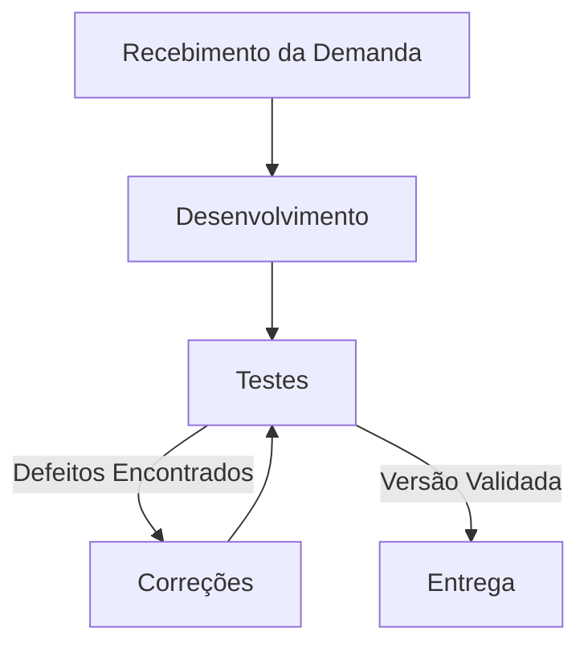

# Aula 12 – BDD e Automação Orientada a Comportamento
# Entrega PBL – LocalEats

## 👥 Integrantes

- Gabrieli Morales Taborda

---

# 🔹 1. Fluxo escolhido

## Integrante: Gabrieli Morales Taborda

### Fluxo
Busca de restaurantes

### Objetivo
Validar se o sistema consegue buscar e listar corretamente um restaurante existente e como ele se comporta ao buscar um restaurante inexistente.

---

# 🔹 2. Cenários BDD

## Arquivo

`features/busca_restaurantes.feature`

## Conteúdo

```gherkin
Feature: Busca de restaurantes
  Como um usuário do LocalEats
  Quero poder buscar restaurantes por nome
  Para encontrar rapidamente opções de refeição que me agradam

  Scenario: Busca por um restaurante existente
    Given que o usuário está na página inicial do LocalEats
    When o usuário pesquisa por um restaurante válido
    Then o sistema deve exibir os restaurantes correspondentes na listagem

  Scenario: Busca por um restaurante inexistente
    Given que o usuário está na página inicial do LocalEats
    When o usuário pesquisa por um restaurante que não existe
    Then o sistema não deve exibir nenhum card de restaurante
```

---

# 🔹 3. Automação com pytest-bdd

## Estrutura do projeto

```text
projeto/
│
├── features/
│   └── busca_restaurantes.feature
│
├── tests/
│   └── test_busca_bdd.py
│
├── evidencias/
│   └── image8.png
│
└── README.md
```

## Arquivo

`tests/test_busca_bdd.py`

## Código

```python
from pytest_bdd import scenarios, given, when, then
from playwright.sync_api import Page, expect

# 1. Carrega o arquivo de comportamento (Feature)
scenarios('../features/busca_restaurantes.feature')


# 2. Definição dos Passos (Steps)

@given('que o usuário está na página inicial do LocalEats')
def acessar_pagina_inicial(page: Page):
    # Acessa direto a página de login para garantir
    page.goto('https://local-eats-unisenac.vercel.app/static/login.html')
    
    # Usa EXATAMENTE o usuário fake que o professor configurou no sistema
    page.get_by_role("textbox", name="teste@teste.com").fill("teste@email.com")
    page.get_by_role("textbox", name="Sua senha secreta").fill("123456")
    page.locator("#loginForm").get_by_role("button", name="Entrar").click()


@when('o usuário pesquisa por um restaurante válido')
def pesquisar_restaurante_valido(page: Page):
    busca_input = page.get_by_role("textbox", name="Buscar por culinária ou")
    busca_input.fill("Sushi") 
    page.get_by_role("button", name="Buscar").click()


@when('o usuário pesquisa por um restaurante que não existe')
def pesquisar_restaurante_invalido(page: Page):
    # Busca por um termo sabidamente inexistente para validar o fluxo alternativo
    busca_input = page.get_by_role("textbox", name="Buscar por culinária ou")
    busca_input.fill("Comida de Marte")
    page.get_by_role("button", name="Buscar").click()


@then('o sistema deve exibir os restaurantes correspondentes na listagem')
def validar_busca_sucesso(page: Page):
    # Valida a presença de elementos que apontam para a página interna dos restaurantes
    expect(page.locator("a[href*='restaurant.html']").first).to_be_visible()


@then('o sistema não deve exibir nenhum card de restaurante')
def validar_busca_vazia(page: Page):
    # Garante que a contagem de links de restaurantes na listagem seja exatamente zero
    expect(page.locator("a[href*='restaurant.html']")).to_have_count(0)
```

---

# 🔹 4. Execução dos testes

## Comando executado

```bash
pytest -v
```

## Resultado

* **Total de cenários:** 2
* **Quantos passaram:** 2
* **Quantos falharam:** 0
* **Tempo de execução:** 3.66s

---

# 🔹 5. Evidências

## Print da execução


---

# 🔹 6. Análise crítica

## O cenário escrito ficou compreensível?
Sim. Utilizando a estrutura Gherkin (Given-When-Then), os cenários foram descritos focando na regra de negócio (buscar restaurante válido vs. inexistente) sem mencionar detalhes técnicos de clique ou código.

## O teste automatizado ficou legível?
Sim. O arquivo `test_busca_bdd.py` reflete exatamente os passos do cenário, utilizando as funções de asserção claras do Playwright (`# Aula 14 - Qualidade de Processo

## 👥 Integrantes

- Gabrieli Morales Taborda

## 1. Mapeamento do Processo

### Fluxo Atual da Equipe



## 2. Entradas, Atividades e Saídas

| Etapa | Entrada | Atividade | Saída |
|---------|---------|---------|---------|
| 1. Recebimento da demanda | Requisitos e regras de negócio | Análise e detalhamento da tarefa | Tarefa definida e critérios de aceite |
| 2. Desenvolvimento | Tarefa definida | Implementação de código e testes unitários | Código desenvolvido |
| 3. Testes | Código desenvolvido | Execução de testes manuais e automatizados | Evidências de teste e/ou relato de defeitos |
| 4. Correções | Relato de defeitos encontrados | Ajustes e refatoração no sistema | Nova versão do código |
| 5. Entrega | Versão de código validada | Publicação (deploy) no ambiente | Funcionalidade entregue ao usuário final |

## 3. Reflexão sobre o Processo

### 1. O processo utilizado pela equipe está claramente definido?
Parcialmente. Existem etapas conhecidas e aplicadas de forma intuitiva, mas a falta de uma documentação detalhada pode abrir margem para que algumas validações sejam esquecidas durante o ciclo de desenvolvimento.

### 2. Todos os integrantes seguem o mesmo fluxo de trabalho?
Como este trabalho está sendo conduzido individualmente, o fluxo adotado no momento é consistente. No entanto, pensando na evolução para um cenário de equipe completa, a falta de padronização documentada frequentemente faz com que atividades sejam realizadas de formas ligeiramente diferentes por cada pessoa.

### 3. Em quais etapas a qualidade é verificada?
A qualidade atua predominantemente na etapa de "Testes" (com as práticas aplicadas anteriormente, como TDD, BDD e testes automatizados) e antes da "Entrega". Para alcançar maior maturidade, a qualidade também deveria ser verificada de forma preventiva logo no "Recebimento da Demanda", avaliando e refinando os requisitos antes de qualquer linha de código ser escrita.

### 4. Quais melhorias poderiam tornar o processo mais eficiente?
- Implementar a prática de "Shift-Left Testing", trazendo o pensamento de qualidade para a fase de planejamento e requisitos.
- Utilizar checklists de validação (Definition of Done) antes de permitir que uma tarefa avance para a etapa de Entrega.
- Expandir a integração dos testes automatizados (E2E) em uma esteira de CI/CD, diminuindo a dependência de validações puramente manuais.

### 5. Como a qualidade do processo impacta a qualidade do produto final?
Os problemas em projetos de software não surgem apenas do código, mas de como o trabalho é organizado. Um processo mal estruturado é a raiz para falhas de comunicação, retrabalho, atrasos e defeitos recorrentes. Por outro lado, um processo com qualidade incorporada traz organização, aumenta a manutenibilidade e garante que o LocalEats seja entregue com alta confiabilidade, agregando valor real ao usuário.to_be_visible()` e `to_have_count(0)`).

## O BDD ajudou a entender o comportamento?
Sim. O uso do BDD transformou um requisito do sistema (a barra de busca precisa funcionar corretamente e não quebrar quando não achar nada) em documentação viva e validável.

## Quais dificuldades surgiram?
* Lidar com o estado da aplicação antes da busca (foi necessário adicionar o login diretamente no passo *Given* para garantir que o usuário estivesse na página inicial correta e logado).
* Escolher o seletor certo para validar a lista de restaurantes. Em vez de validar o texto, validamos se o link para o restaurante `a[href*='restaurant.html']` aparece na tela.

## Os seletores foram frágeis e o teste ficou dependente da interface?
Parcialmente. O uso do `get_by_role("textbox", name="Buscar por culinária ou")` depende do texto (placeholder) inserido no input. Se o frontend mudar esse texto amanhã, a automação quebra. 

## O cenário representa realmente uma regra de negócio?
Sim. A busca de restaurantes é o fluxo principal de descoberta do sistema. Se o usuário não consegue encontrar o que deseja, o LocalEats perde seu principal valor.

## O que tornaria o teste mais robusto?
Para tornar a automação blindada, os desenvolvedores deveriam implementar atributos específicos para testes de E2E, como `data-testid="search-input"`. Além disso, abstrair a etapa de Login do passo *Given* (usando *fixtures* ou *Page Objects*) deixaria o teste mais limpo.

---

# 🔹 7. Reflexão no contexto do LocalEats

## BDD melhora comunicação entre a equipe?
Sim. O Gherkin serve como uma linguagem universal onde o Product Owner, os Desenvolvedores e QA concordam sobre o que o software deve fazer antes mesmo da primeira linha de código ser escrita.

## Todo teste deve ser escrito em BDD?
Não. BDD adiciona uma camada extra de abstração. Ele é excelente para fluxos E2E e regras de negócio claras, mas seria um exagero para testes unitários ou validações técnicas puras de API.

## Quando vale a pena usar BDD?
Vale a pena ser utilizado nos caminhos felizes e críticos do sistema (como a Busca de Restaurantes e o Checkout), onde documentar o comportamento esperado ajuda a prevenir *bugs* de regra de negócio.

## Como isso ajuda no projeto?
Permite criar uma suíte de testes que não apenas automatiza cliques, mas garante que os fluxos vitais do usuário estejam funcionando. Facilita manutenções futuras, pois se a regra mudar, mudamos primeiro o Gherkin, e depois o código refletirá essa mudança.

---

# 📦 Repositório GitHub

https://github.com/gabrielimt/unisenac_qualidade_de_software

---

# ✅ Conclusão

A atividade demonstrou na prática o poder do BDD utilizando pytest-bdd e Playwright. Foi possível mapear uma regra de negócio (Busca), abstrair a técnica em arquivos separados, contornar problemas de estado de login no setup inicial e criar validações fortes de UI para cenários positivos e negativos.