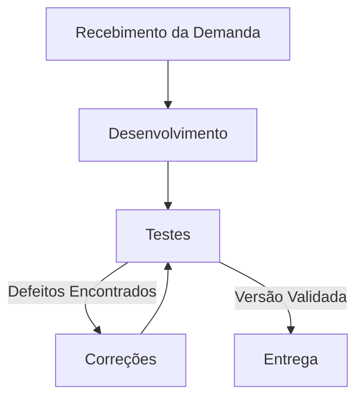

# Aula 14 - Qualidade de Processo

## 👥 Integrantes

- Gabrieli Morales Taborda

## 1. Mapeamento do Processo

### Fluxo Atual da Equipe

## 2. Entradas, Atividades e Saídas

| Etapa | Entrada | Atividade | Saída |
|---------|---------|---------|---------|
| 1. Recebimento da demanda | Requisitos e regras de negócio | Análise e detalhamento da tarefa | Tarefa definida e critérios de aceite |
| 2. Desenvolvimento | Tarefa definida | Implementação de código e testes unitários | Código desenvolvido |
| 3. Testes | Código desenvolvido | Execução de testes manuais e automatizados | Evidências de teste e/ou relato de defeitos |
| 4. Correções | Relato de defeitos encontrados | Ajustes e refatoração no sistema | Nova versão do código |
| 5. Entrega | Versão de código validada | Publicação (deploy) no ambiente | Funcionalidade entregue ao usuário final |

## 3. Reflexão sobre o Processo

### 1. O processo utilizado pela equipe está claramente definido?
Parcialmente. Existem etapas conhecidas e aplicadas de forma intuitiva, mas a falta de uma documentação detalhada pode abrir margem para que algumas validações sejam esquecidas durante o ciclo de desenvolvimento.

### 2. Todos os integrantes seguem o mesmo fluxo de trabalho?
Como este trabalho está sendo conduzido individualmente, o fluxo adotado no momento é consistente. No entanto, pensando na evolução para um cenário de equipe completa, a falta de padronização documentada frequentemente faz com que atividades sejam realizadas de formas ligeiramente diferentes por cada pessoa.

### 3. Em quais etapas a qualidade é verificada?
A qualidade atua predominantemente na etapa de "Testes" (com as práticas aplicadas anteriormente, como TDD, BDD e testes automatizados) e antes da "Entrega". Para alcançar maior maturidade, a qualidade também deveria ser verificada de forma preventiva logo no "Recebimento da Demanda", avaliando e refinando os requisitos antes de qualquer linha de código ser escrita.

### 4. Quais melhorias poderiam tornar o processo mais eficiente?
- Implementar a prática de "Shift-Left Testing", trazendo o pensamento de qualidade para a fase de planejamento e requisitos.
- Utilizar checklists de validação (Definition of Done) antes de permitir que uma tarefa avance para a etapa de Entrega.
- Expandir a integração dos testes automatizados (E2E) em uma esteira de CI/CD, diminuindo a dependência de validações puramente manuais.

### 5. Como a qualidade do processo impacta a qualidade do produto final?
Os problemas em projetos de software não surgem apenas do código, mas de como o trabalho é organizado. Um processo mal estruturado é a raiz para falhas de comunicação, retrabalho, atrasos e defeitos recorrentes. Por outro lado, um processo com qualidade incorporada traz organização, aumenta a manutenibilidade e garante que o LocalEats seja entregue com alta confiabilidade, agregando valor real ao usuário.